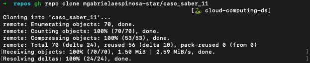
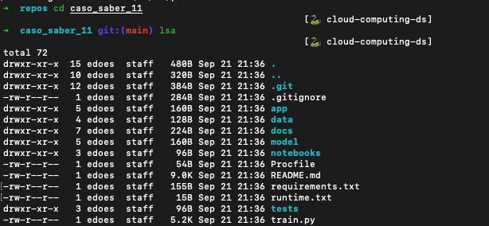
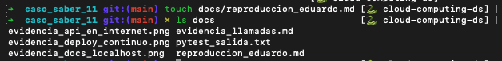
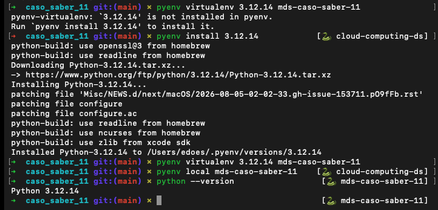

# Evidencias Eduardo Palma

## 1) Clonar e instalar
- Clone

- cd caso_saber_11

- creación de doc de reproducibilidad

- Ajustar versión a 3.12.14

- pip install -r requirements.txt
Successfully installed
