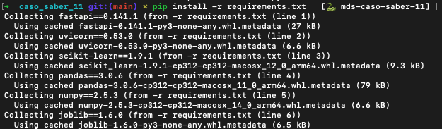
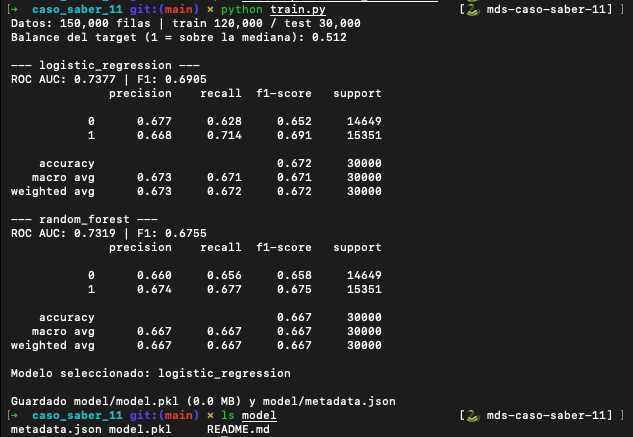
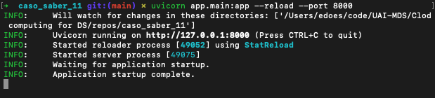
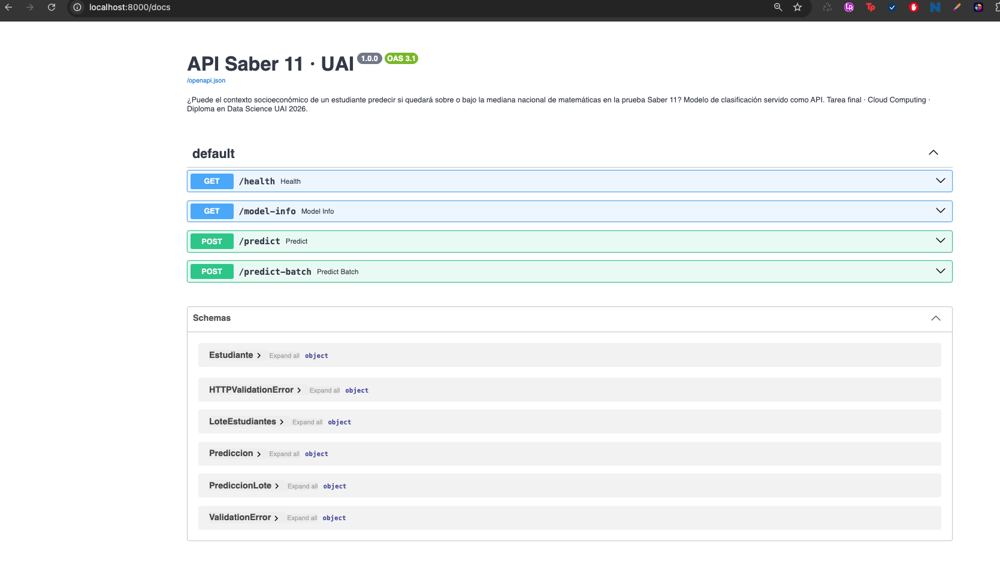
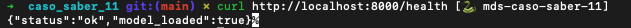
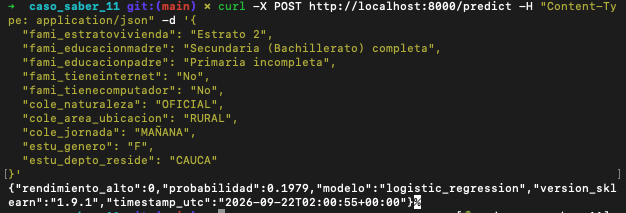
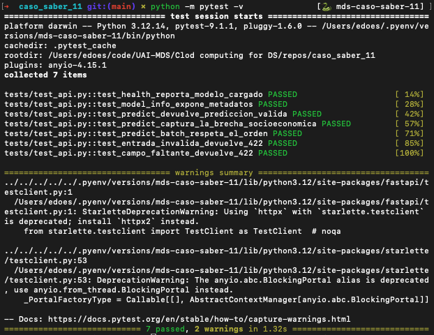

# Evidencias Eduardo Palma

## 1) Clonar e instalar

### Clonar repositorio

```bash
gh repo clone mgabrielaespinosa-star/caso_saber_11
```


### cd caso_saber_11


### creación de doc de reproducibilidad


### Ajustar versión a 3.12.14


### pip install -r requirements.txt


Successfully installed


## 2) (Opcional) Re-entrenar el modelo — regenera model/model.pkl y metadata.json
```bash
python train.py
```




## 3) Levantar la API
```bash
uvicorn app.main:app --reload --port 8000
```




### → documentación interactiva en http://localhost:8000/docs




## 4) Probar

### health

```bash
curl http://localhost:8000/health
```



### predict

```bash
curl -X POST http://localhost:8000/predict -H "Content-Type: application/json" -d '{
  "fami_estratovivienda": "Estrato 2",
  "fami_educacionmadre": "Secundaria (Bachillerato) completa",
  "fami_educacionpadre": "Primaria incompleta",
  "fami_tieneinternet": "No",
  "fami_tienecomputador": "No",
  "cole_naturaleza": "OFICIAL",
  "cole_area_ubicacion": "RURAL",
  "cole_jornada": "MAÑANA",
  "estu_genero": "F",
  "estu_depto_reside": "CAUCA"
}'
```




## 5) Correr las pruebas
```bash
python -m pytest -v
```


